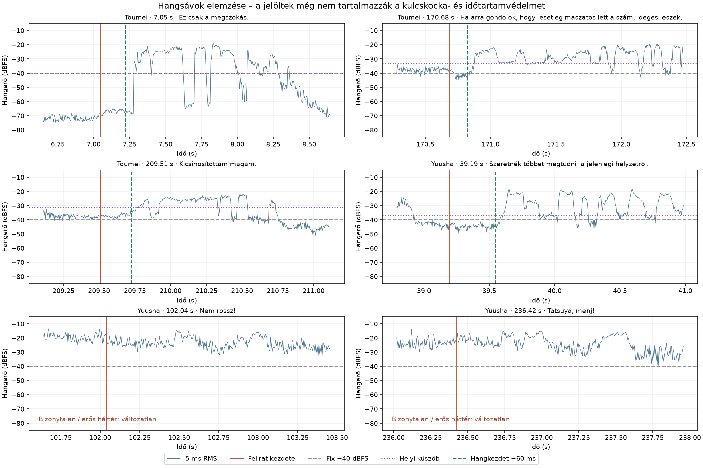

# Hangkezdet és háttérzaj – helyi mérés

Dátum: 2026-09-23.

A vizsgálat a felhasználó által megadott **Toumei 05** és **Yuusha-kei 11**
ASS-fájlját és a bennük hivatkozott MKV japán hangsávját használta.
A Toumei 331, a Yuusha 319 nem komment, `Default` kezdetű stílusú
párbeszédsorának elejét vizsgáltuk. Az eredeti ASS-fájlok változatlanok;
ezt a vizsgálat előtti és utáni SHA-256 összehasonlítás ellenőrizte.

## Felismert minták

Az alábbi táblázat és ábra az első, 60 ms-os előtartással vizsgált változat
eredményeit őrzi. A jelenlegi változat 100 ms-ot használ, és a lent leírt
további védelmek miatt néhány korábbi jelöltet kihagy vagy korábban felismer.

A Toumei több megszólalása előtt igen halk, jól elkülönülő szakasz van.
Más jelenetekben a háttér a fix −40 dBFS küszöböt is meghaladja, mégis
látszik rajta a megszólalás tartós emelkedése. A Yuusha erős harci
hangképe sok helyen már a feliratsor előtt is hangos és változó;
itt a hangerő önmagában nem választja el a beszédet az effektektől.

| Minta | Felirat kezdete | Kezdő háttérszint* | Tartós hang jelöltje | Hangkezdet −60 ms, ASS-ra kerekítve |
| --- | ---: | ---: | ---: | ---: |
| Toumei – „Ez csak a megszokás.” | 7,050 s | −67,7 dBFS | 7,280 s | 7,220 s |
| Toumei – „Ha arra gondolok…” | 170,680 s | −38,7 dBFS | 170,880 s | 170,820 s |
| Toumei – „Kicsinosítottam magam.” | 209,510 s | −37,2 dBFS | 209,785 s | 209,730 s |
| Yuusha – „Szeretnék többet megtudni…” | 39,190 s | −43,0 dBFS | 39,605 s | 39,550 s |
| Yuusha – „Nem rossz!” | 102,040 s | −23,5 dBFS | Bizonytalan, kihagyva | Változatlan |
| Yuusha – „Tatsuya, menj!” | 236,420 s | −20,1 dBFS | Bizonytalan, kihagyva | Változatlan |

\* Az első 60 ms rövid RMS-ablakainak mediánja; önmagában nem bizonyítja,
hogy az adott hang háttérzaj vagy beszéd.

**A táblázat és az ábra hangalapú jelölteket mutat, nem végrehajtott
feliratjavításokat.** Kulcskockán kezdődő sort a hanglépés nem módosít.
A kijelölés, az átfedések, a szomszéd sorok, a minimum időtartam és az
olvasási sebesség korlátja további jelölteket zárhat ki.

## A megvalósított hanglépés

A meglévő időzítési szabályok után fut, a már betöltött Aegisub-hangforrásból.
Az alkalmazásban nem indít FFmpeg-et, nem készít külön hangfájlt, és nem
használ külső szolgáltatást. Hiányzó hangnál a hanglépés kimarad.

- 5 ms-os, DC-eltolástól megtisztított RMS-ablakokban mér.
- Alapérték: −40 dBFS minimum küszöb és 40 ms tartós hang. A 2026-09-30-i
  változat beállítási és összegző ablak nélkül, az alapértékekkel fut.
- Halk, stabil kezdő háttérnél legalább 6 dB emelkedést kér a helyi
  háttérhez képest. Az első 60 ms-ot és az előző legfeljebb 300 ms-ot
  hasonlítja össze. Az előzmény halkabb részéhez viszonyított emelkedés
  a sor előtt kezdődő, már folyó gyenge hangot is védi. Erős
  (−32 dBFS fölötti), ingadozó vagy bizonytalan kezdőhangnál nem keres
  egy későbbi, hangosabb szótagot.
- A megerősítéshez ténylegesen küszöb felett töltött időt mér, legfeljebb
  10 ms-os köztes visszaeséseket engedve. A jelölt szakasz legalább 75%-a
  legyen az erősebb küszöb felett; elszórt kattanások nem adódhatnak össze.
- A megerősített hang legfeljebb 120 ms-os, összefüggő gyengébb kezdetét
  is megtartja, legalább 4 dB háttérkontraszttal. Ha egy korábbi, legalább
  40 ms-os gyenge hangszakasz nem kapott megerősítést, nem ugorja át egy
  későbbi hang kedvéért. A felhasználó által választott nagyobb minimum
  hanghossz ezt a gyengehang-védelmi időt is növeli.
- Csak jobbra mozgathatja a sor kezdetét, a hangjelölt elé 100 ms-mal.
  Az ASS 10 ms-os pontosságára kerekít; ezért az előtartás néhány ms-mal
  eltérhet. Nem teheti a kezdést a hang előtti legutóbbi kulcskocka elé.
- Átfedő beszédcsoportnál csak az első sor kezdete vizsgálható. Nem
  keres bele a következő beszélő sorába, és nem rövidít az olvasási korlát alá.
- Az új lépés a vizsgált sor saját végét nem állítja. A vele pontosan
  folytonos, kijelölt előző sor végét együtt mozgatja a kezdettel.
  Több közös előző vég együtt marad. Kulcskockán álló kezdés vagy vég
  védett; ha a teljes közös határ nem mozgatható biztonságosan, kimarad.
- A nem kijelölt sorok nem változnak. Megszakításkor az új időpontok
  nem kerülnek a feliratba; az alkalmazás egy lépésben visszavonható.

## Módszer és korlátok

### A négy nyers–végleges pár alapján végzett finomítás

A Toumei 1–4. részében 942 azonos szövegű és szereplőjű sorpárt hasonlítottunk
össze. Az 1. rész 08:23,38-as „Hát... mert te kíséred őt.” soránál a korábbi
detektor 08:24,445-ös hangkezdetet javasolt. A hosszabb előzmény vizsgálatával
ezt most bizonytalan, már aktív hangként kihagyja; nem húzza el a kezdést egy
másodperccel. Az eredeti 44,1 kHz-es, FFMS-sel betöltött hang is ellenőrzésre
került. A 2. rész 03:48,96-os példájában a korábbi gyengébb hangszakasz
átugrásának védelme lép működésbe.

A C++ megvalósítást összesen 1592 valódi hangintervallumon vetettük össze
a külön elemzőprogrammal: a négy rész 942 sorpárján, valamint a Toumei 05
331 és a Yuusha 11 319 beszédsorán. Minden eredmény egyezett ugyanazon a PCM-en.
A Toumei 05 első csendes példája továbbra is 7,280 s-os hangkezdetet ad,
a jelenlegi 100 ms-os előtartásból 7,180 s-os ASS-kezdés következik.
Az erős Yuusha-példák továbbra is kimaradnak.

A módosítás szándékosan óvatosabb. A négy részben 662, a Toumei 05-ben 223,
a Yuusha 11-ben 135 intervallum adott megerősített hangjelöltet. Ezek nem
automatikusan alkalmazott módosítások és nem pontossági adatok. A gyengébb
kezdések visszakeresése, a rövid hangerőesések kezelése, a kattogás kizárása,
a hang előtti előtartás, valamint a kulcskockás közös végek megőrzése külön
regressziós teszteket kapott.

### Az első változat kiinduló mérései

A helyi elemzéshez a sztereó AAC-t 48 kHz-es, 16 bites monó PCM-re
alakítottuk, a két csatorna átlagolásával és a kezdő időbélyeg megtartásával.
Soronként legfeljebb az első 1500 ms került a hangjelölt-vizsgálatba.
A natív C++ detektort ugyanezen PCM-adatokon is lefuttattuk:
mind a 650 eredménye egyezett az elemzőprogram eredményével.
Az alkalmazás a betöltött hang eredeti, támogatott mintavételi frekvenciáján
dolgozik; itt nem a dekóder vagy a teljes parancs sebességét mértük.

A fix küszöb a Toumei 120/331 és a Yuusha 213/319 sorának első 60 ms-ában
már a kezdeti medián alatt volt. Ez indokolja a háttérhez igazodó küszöböt.
A hangalapú, 60 ms-nál későbbi jelöltek száma a fix módszerrel 229 és 116,
a helyi háttérhez igazított módszerrel 255 és 173 lett. Az utóbbi 73,
illetve 145 sort a bizonytalan kezdőhang miatt eleve kihagyott.
Ezek **nem pontossági adatok vagy helyes javítások számai**: nincs hozzájuk
kézzel címkézett beszédkezdet, és a kulcskockavédelem még nincs beleszámítva.

A kezdeti 9 dB-es relatív küszöb a Toumei 209,510 s-os példájánál csak
209,925 s-nál talált tartós emelkedést, a 6 dB-es változat 209,785 s-nál.
Ez mutatja, hogy a túl magas küszöb a halk első szótagot is átugorhatja.
A halk beszéd, a zene és a hosszabb effektek továbbra is összetéveszthetők
puszta hangenergia alapján. A megoldás konzervatív hangkezdet-érzékelés,
nem beszédfelismerés vagy beszélőazonosítás; az erős harci jelenetekhez
nem ígér automatikusan helyes igazítást.
