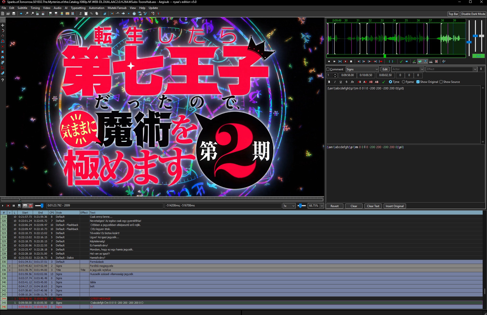

# Dark mode and customizable colors

[New features](README.md) · [Magyar](../hu/dark-mode.md)

**Where to find it:** Settings → Interface; color settings.

Dark mode can be enabled separately and includes new icons and independently customizable interface colors.

- Enable the dark appearance when you need it.
- The new icons make the interface more consistent and easier to scan.

- Customize the interface colors separately.

## Commands for shortcut settings

- `app/options`

> The separate dark-mode switch is available in builds using wxWidgets 3.3 or later.

## Screenshots and demonstrations

### Dark mode

Dark mode, new icons, and custom interface colors.

## Related features

- [Font picker](font-picker.md)

[Back to the feature index](README.md)
