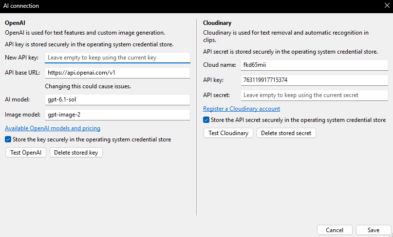

# AI kapcsolat beállítása

Az `AI -> AI-kapcsolat beállítása...` menüpontban lehet megadni a kapcsolódási lehetőségeket, melyhez alább olvasható útmutató.

## OpenAI

Az OpenAI kapcsolathoz érvényes előfizetéssel rendelkező API kulcs szükséges, amit ideiglenesen és biztonságosan véglegesen is tárolhatsz a további műveletekhez.
Létrehozáshoz viszont nem szükséges komplett előfizetés, elég csupán egyszer feltölteni kezdeti kerettel (jelenleg 10 EUR) és azt használja elfogyásig, aggódni pedig nem kell, mert bankkártya adatokat utána ki lehet törölni, hogy ne vonjon le semmit.

> Ez a model a szöveges funkciókhoz van főként.

1. Lépj be az alábbi oldalon: [https://platform.openai.com/login](https://platform.openai.com/login)
2. Ingyenes csomaggal indulj, szükséges adatokat megadhatsz, ha gondolod
3. Az alábbi oldalon adj hozzá fizetési módot: [https://platform.openai.com/settings/organization/billing/overview](https://platform.openai.com/settings/organization/billing/overview)
4. Auto-reload-ot kapcsold ki és a minimum összeget add hozzá
5. Ezután a csomagod "Pay as you go"-ra váltott "Free trial"-ról
6. Töröld ki a fizetési módot a "payment menthod"-ban
7. Adj hozzá API kulcsot itt (lejárati dátum nem javasolt): [https://platform.openai.com/settings/organization/api-keys](https://platform.openai.com/settings/organization/api-keys)
8. Az így kapott secret kulcsot be lehet illeszteni az Aegisub-ba.

## Cloudinary

Ezen szolgáltatás lényegében ingyenes, mert havi több száz használatot engedélyez ingyenes csomagban és bankkártya adatok sem kellenek hozzá.

> Ez a model formázási funkciókhoz van főként, mint pl. a szöveg eltávolítás.

1. Lépj be az alábbi oldalon: [https://cloudinary.com/users/register_free](https://cloudinary.com/users/register_free)
2. Az "API Keys" menüpontban adj hozzá új kulcsot
3. Másold be az API kulcsot, a secretet és fenti a cloud namet (cím mellett található). Figyelj oda, hogy spacet ne tartalmazzon!