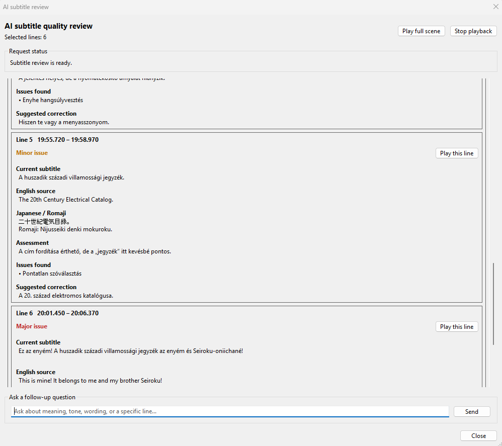
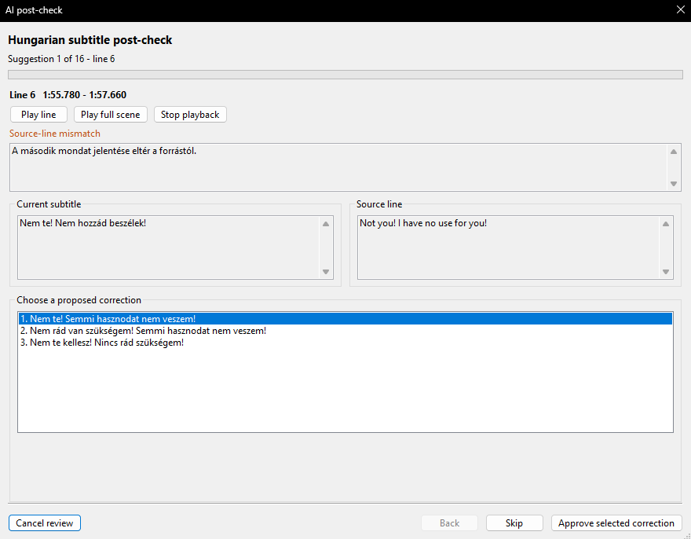

[Vissza](README.md)

# AI review és utóellenőrzés

## Bevezetés

Az AI használatával több területen is segítségünkre lehet, amelyhez szükséges egy összeköttetés, mely beállításához útmutató az alábbi linken található:
[AI-kapcsolat beállítása](ai-connection.md)

Az alább látható funkciókhoz OpenAI-kapcsolat szükséges, javasolt a legfrissebb modell használata, melyet az `AI → AI-kapcsolat beállítása...` menüpontban lehet megadni és az alábbi linken található. Jelenleg a legfrissebb "sol" model a javasolt.
[AI modellek](https://developers.openai.com/api/docs/models)

> A költség természetesen a használattól függ, de feliratonként pár cent lehet maximum. Ketten használunk egy kulcsot és hónapok óta nem használt el 1 EUR-t sem.

## AI review

Kijelölt sorok fordítását véleményezi egy ablakban az AI, amit főként a japán hang alapján teszi, de figyelembe veszi a forrásort is, ha elérhető.
A felugró ablakban javaslatokat tesz a sorokhoz, ahol az adott jelenetről még chatelni is lehet, és a jelenetet külön le lehet játszani.

> Használat: kijelölt soroknál `AI → Kijelölt sorok ellenőrzése AI-jal...` vagy `ai/review` parancs.

> Maximum 2 perces jelenetet enged a funkció és csak támpontot ad, érdemes úgyis kezelni. Nagyon hasznos lehet, ha a forrás fordítása furának tűnik.

## AI utóellenőrzés

A kijelölt sorokat ellenőrzi a megadott nyelvre helyesírási, fogalmazási és egyéb hibákra. Még fordítást is néz, ha van forrássor.
Új ellenőrzést vagy korábbit is lehet futtatni újra.

Egy felugró ablakban megjelennek a javaslatok egymás után, ahol soronként kiválasztható, hogy mely javaslatot akarjuk elfogadni és lehet átugrani is. Az adott sort le is lehet játszani, hogy ellenőrizhessük. Miután végig lépegettünk az ablakban, a változtatott sorok effekt mezőjébe bekerül pár infó, ezáltal ellenőrizni tudjuk, hogy ami változott, az rendben van-e.

> Használat: kijelölt soroknál `AI → AI utóellenőrzés → Új` vagy `ai/proofread` parancs.

