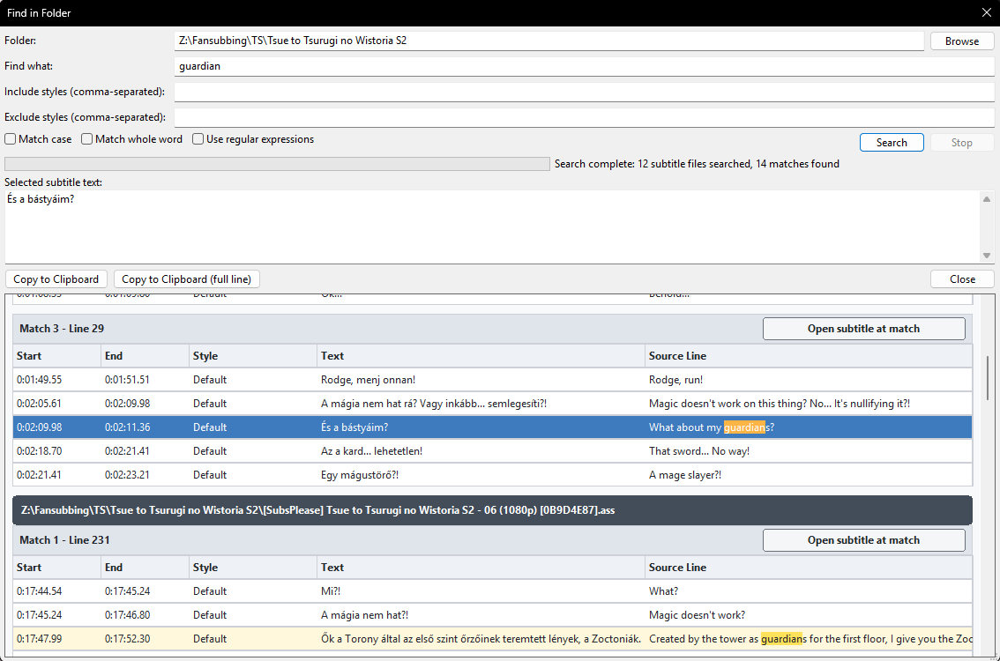

[Vissza](README.md)

# Keresés mappában

A `Szerkesztés → Keresés mappában..." menüponton érheted el, melynek segítségével rekurzívan lehet keresni egy mappa feliratfájljaiban gyorsan. A megjelenő találatok közeli 2-2 sorát is mutatja adott találatnál, amiket kiválasztva felülre betölti a tartalmat és ki lehet másolni a szöveget vagy a teljes sort is. A találathoz tartozó feliratot meg is lehet nyitni külön Aegisub ablakban, és rögtön az adott sorra is ugrik.

Kereséskor lehet kis- és nagybetű megközelítéssel, teljes szöveggel és regex-szel is keresni, stílusokat hozzáadni vagy elvenni a keresésből.

> Forrássorokban is keres, így meg lehet találni azt, hogy egy bizonyos kifejezést hogyan fordítottuk korábban.

[Vissza](README.md)