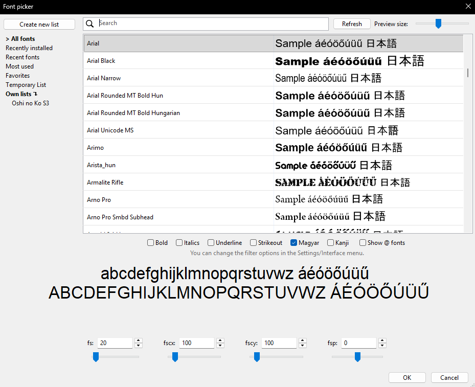

# Villámgyors fontválasztó azonnali előnézettel

[Új funkciók](README.md) · [English](../en/font-picker.md)

**Hol találod:** A feliratszerkesztő betűtípusválasztója.

A betűtípuslista gyorsítótárat használ, amelyet a betűtípusok változásakor kell frissíteni. A választó megjegyzi az ablak helyét, és a név bármely részére lehet keresni.

## Szűrés és rendszerezés

- Magyar, kanji és saját karakterkészlet-szűrők.
- A @ fontok elrejthetők.

- Legutóbbi, leggyakoribb, kedvenc, ideiglenes és saját listák.

## Azonnali kipróbálás

A kijelölt sorok rögtön a választott fonttal jelennek meg. Az `\fs`, `\fscx`, `\fscy`, `\fsp` és az alapvető szövegstílusok is állíthatók.

**Saját mintaszöveg:** a Beállítások → Felhasználói felület alatt módosítható.

## Gyorsbillentyűhöz kereshető parancsok

- `edit/font`

## Képek és bemutatók

### A teljesen új fontválasztó

Gyors keresés, nyelvi szűrők, kategóriák és azonnali előnézet.

## Kapcsolódó funkciók

- [Szövegdoboz](text-box.md)
- [Szövegszerkesztés](text-editing.md)

[Vissza a funkciójegyzékhez](README.md)
