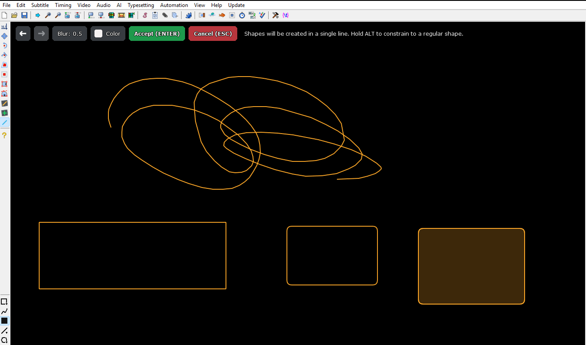

# Alakzatok és szabadkézi rajzok

[Új funkciók](README.md) · [English](../en/shapes.md)

**Hol találod:** Videó vizuális eszköztára → Alakzatok.

Négyzetet, kört, szívet és más formákat rajzolhatsz teli vagy üres változatban, állítható vonalvastagsággal és lekerekítéssel.

- Szabadkézi rajz bekarikázáshoz vagy jelöléshez.
- Az `Alt` nyomvatartása szabályos arányra kényszeríti az alakzatot.

- A szín és blur is közvetlenül beállítható.

## Gyorsbillentyűhöz kereshető parancsok

- `video/tool/shape`

## Képek és bemutatók

### Alakzatok és szabadkézi rajzok

Teli, üres, lekerekített és szabadkézi formák.

## Kapcsolódó funkciók

- [Maszkok](masks.md)
- [Vizuális eszközök](visual-tools.md)

[Vissza a funkciójegyzékhez](README.md)
