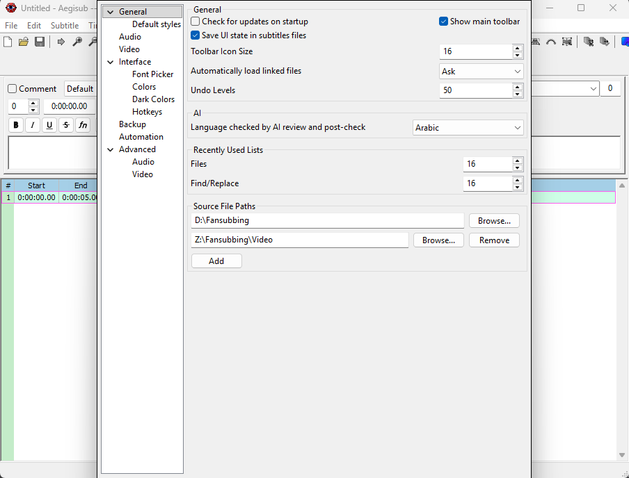

[Vissza](README.md)

# Forrásmappák

A Beállítások - Általános - Forrásmappák résznél megadhatsz mappákat, hogy hol keressen videót/audiót a program. A felirat betöltésénél a hozzátartozó fájlnév alapján keres és egyezés esetén betölti, ha korábban kértük a fájlok betöltését.

> Többet is megadhatsz. A listán sorrendben megy végig és az első egyezésnél betölti a videót.

> Ha a feliratban található útvonalon létezik a hozzárendelt videó/audió, akkor az élvez elsőbbséget.

[Vissza](README.md)