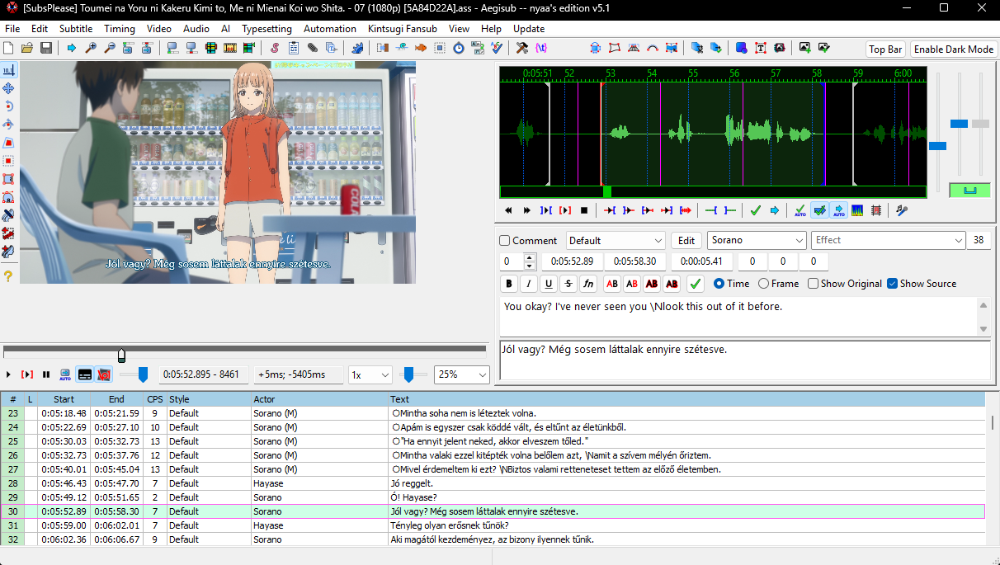

[Vissza](README.md)

# Forrássorok

A program magától megjegyzi és tárolja a forrás felirat eredeti verzióját. A funkció csak akkor működik, ha videóból töltjük be a feliratot. A feliratsor különféle műveleteivel automatikusan szinkronizálja az adatot és mentéskor extradatában tárolja, hogy a lektornak ott legyen megnyitáskor például az angol eredeti mondat. 

A funkciót a szövegdobozban lehet bekapcsolni "Forrás sor mutatása" pipával.

> Vigyázat! Más verziós Aegisubban megnyitva és mentve a feliraton elvesztődik a forrássor.

[Vissza](README.md)